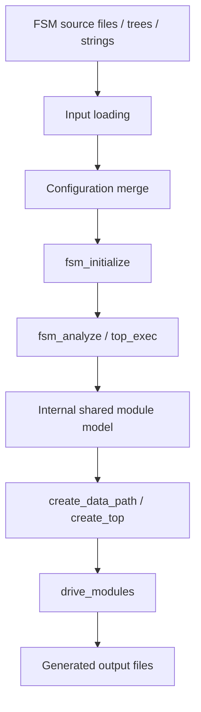

# Architecture Overview

The active FSMGen pipeline can be understood as a staged transformation flow.

## Stage summary

### 1. Input loading

The input can arrive through:

- `start_from_file(...)`
- `top_from_tree(...)`
- `top_from_string(...)`

File input goes through `fsm_file_load(...)`, which currently delegates to `Lispish::multi(...)`.

### 2. Configuration merge

The entrypoints merge caller options with the active `fsmgen` config profile. This is where defaults like block-prefix behavior, top/data-path names, and output-related settings come together.

### 3. Initialization

`fsm_initialize(...)` builds the initial global structure:

- normalized config,
- loaded FSM/top/define paragraphs,
- and bookkeeping fields used later by analysis and generation.

### 4. FSM analysis

`fsm_analyze(...)`, `fsm_analyze_jo(...)`, `fsm_walk(...)`, and related decision-tree helpers walk the FSM description model and derive:

- states,
- resets,
- conditions,
- generated boolean helpers,
- entity information,
- architecture information.

### 5. Top and hierarchy assembly

`top_exec(...)`, `create_data_path(...)`, and `create_top(...)` are where the higher-level module graph is assembled.

This is also where FSMGen reasons about:

- submodules,
- interface propagation,
- inferred top inputs and outputs,
- internal signals,
- exceptions and overrides,
- and plugin hooks.

### 6. Output emission

`drive_modules(...)` writes the final generated files into the configured output directory. Top-level modules may be emitted differently from non-top modules, but they all flow through the same shared module model.

## Key architectural fact

The most important internal design point is this:

FSMGen is model-driven first and file-driven second.

By the time files are emitted, the important work has already happened in the internal shared model under structures like:

- `shared`
- `module`
- `conf`
- `odb`

That is why this book documents both the external surface and the internal model.
